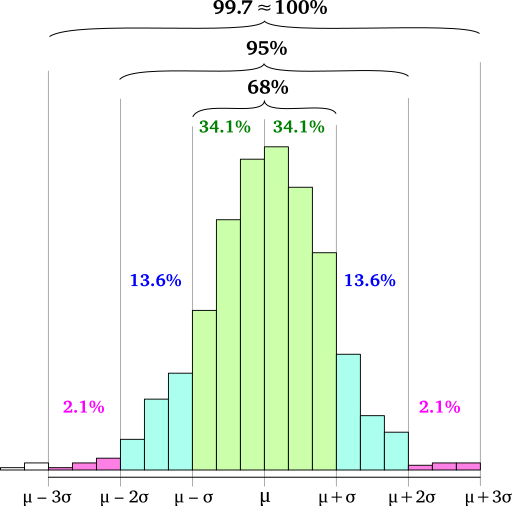

```{r setup, include=FALSE}
knitr::opts_chunk$set(echo = FALSE)
library(tidyverse)
theme_set(theme_minimal())
library(patchwork)
library(brms)
options(mc.cores = parallel::detectCores())
rstan::rstan_options(auto_write = TRUE)
library(bayesplot)
library(extraDistr)
```

```{r prepare-data}
f_end <- readRDS("./data/f_end.rds")
```

## Road map

1. Basic concepts.
1. Choosing priors.
1. Model fitting with brms.
    1. Normal.
    1. Log-normal.
    1. Binomial (Bernoulli).
1. Bayesian inference.

<!-- ## Learning outcomes -->

<!-- * Understand the basic concepts behind Bayesian statistics and how it differs from frequentist statistics. -->
<!-- * Understand priors and how to choose them. -->
<!-- * Be able to set up and fit a Bayesian linear regression model using brms. -->
<!-- * Understand Bayesian inference methods. -->

## 

\centering \Huge

BASIC CONCEPTS

## Random variables

* We have a question about the world, so we collect data (sample from a population).
  * y = ($y_1$, $y_2$, $y_3$, $y_4$, ..., $y_n$)
* We want to know how the data (the sample $y$) was generated.
* In probability theory, data is generated by a random variable $Y$.

## Random variables

* $Y$ is a variable whose value is generated by a random event.
* $Y$ is uncertain.
  * We can describe $Y$ as a probability distribution.

## Random variables

* Probability distribution.
  * A list of the values a random variable could take on along with their corresponding probability.
* Probability distributions can be expressed by a set of parameters $\Theta = (\theta_1, ..., \theta_n)$.
* Some probability distributions:
  * $Normal(\mu, \sigma)$,
  * $Binomial(n, p)$,
  * $Poisson(\lambda)$

## Continuous random variables

\centering \Huge

$y_i \sim Normal(\mu, \sigma)$

## Frequentist vs Bayesian view

* Parameters: $\mu$, $\sigma$, $p$, $\lambda$, ...
* Frequentist view:
  * The parameters are **fixed** (they are unknown but certain).
  * They take on a specific value.
* Bayesian view:
  * The parameters are **random variables** (they are unkown and uncertain).
  * We describe each parameter as a probability distribution, expressed by a set of **hyperparameters**.

## Priors 

* We want to estimate the parameters $\mu$ and $\sigma$ from the data.
* We can incorporate previous knowledge (belief) about the parameters using **priors** (*prior probability distributions*).
  * We specify the hyperparameters of the prior probability distributions.
* Priors are chosen based on expert knowledge, previous studies, pilot data...
  * Priors must **not** be chosen based on inspection of the data to be analysed.

## Bayesian belief update

\large

$$ observed\ data \times prior\ belief = posterior\ belief $$

## Bayesian belief update

<https://nanx.shinyapps.io/conjugate-normal-umkv/>

##

\centering \Huge

CHOOSING PRIORS

## Italian F1

* Toy example with F1.
* Data:
  * Italian.
  * 7 speakers.
  * CVCV words in frame sentence.
    * C1 = /p/.
    * V1 = V2 = /a, o, u/.
    * C2 = /t, d, k, g/.

## Italian F1

Formant values are roughly distributed according to a normal (Gaussian) distribution.

$$ \textit{F1}_i \sim Normal(\mu, \sigma) $$

## Normal (Gaussian) distribution

```{r standard-normal}
ggplot() +
  aes(x = c(-4, 4)) +
  stat_function(fun = dnorm, n = 101, args = list(0, 1)) +
  labs(
    title = "Standard normal (Gaussian) distribution",
    subtitle = "mean = 0, SD = 1",
    x = element_blank(), y = element_blank()
  )
```

## Normal (Gaussian) distribution

\centering

{width=250px}

\tiny Melikamp, https://commons.wikimedia.org/wiki/File:Empirical_rule_histogram.svg (CC BY-SA 4.0)

## Italian F1

* $Normal(\mu, \sigma)$ has two parameters, $\mu$ and $\sigma$.
* $\mu$ and $\sigma$ are random variables (unkown and uncertain).
* We express these parameters as priors (probability distributions with hyperparameters).

## Prior for the mean

\centering \Large

$\textit{F1}_i \sim Normal(\mu, \sigma)$

\normalsize

What prior for $\mu$?

## Prior for the mean

\centering \Large

$\textit{F1}_i \sim Normal(\mu, \sigma)$

$\mu \sim Normal(\mu_1, \sigma_1)$

## Prior for the mean

$Normal(0, 500)$ as the prior for $\mu$.

* This means that we believe $\mu$ to be between -1000 and +1000 at 95% confidence.
  * 95% credible interval (CI) = $[\mu_1-2\sigma_1, \mu_1+2\sigma_1]$.

## Prior for the mean

```{r mean-prior}
ggplot() +
  aes(x = c(-2000, 2000)) +
  stat_function(fun = dnorm, n = 101, args = list(0, 500)) +
  labs(
    title = expression(paste("Prior for ", mu)),
    subtitle = expression(paste(mu, " = 0,  ", sigma, " = 500")),
    x = element_blank(),
    y = element_blank()
  )
```

## Type of priors

* Informative and weakly informative priors.
* Uninformative or diffuse priors.
  * Uniform distribution.
* Regularising priors.

## Prior for the standard deviation

\centering \Large

$\textit{F1}_i \sim Normal(\mu, \sigma)$

$\mu \sim Normal(0, 500)$

What about $\sigma$?

## Prior for the standard deviation

\centering \Large

$\textit{F1}_i \sim Normal(\mu, \sigma)$

$\mu \sim Normal(0, 500)$

$\sigma \sim HalfCauchy(x_0, \gamma)$

## Prior for the standard deviation

```{r cauchy-prior}
ggplot() +
  aes(x = c(0, 100)) +
  stat_function(fun = dhcauchy, n = 201, args = list(5), colour = "#1b9e77", size = 1) +
  stat_function(fun = dhcauchy, n = 201, args = list(15), colour = "#d95f02", size = 1) +
  stat_function(fun = dhcauchy, n = 201, args = list(25), colour = "#7570b3", size = 1) +
  labs(
    title = "Half Cauchy prior",
    x = element_blank(),
    y = element_blank()
  )
```

## Prior for the standard deviation

```{r cauchy-2-hdi, echo=TRUE}
library(HDInterval)
inverseCDF(c(0.025, 0.975), phcauchy, 5)
inverseCDF(c(0.025, 0.975), phcauchy, 15)
inverseCDF(c(0.025, 0.975), phcauchy, 25)
```

## Italian F1

\centering \Large

$\textit{F1}_i \sim Normal(\mu, \sigma)$

$\mu \sim Normal(0, 500)$

$\sigma \sim HalfCauchy(0, 25)$

##

\centering \Huge

MODEL FITTING

## Italian F1

* We have a model which incorporates our (vague) knowledge about F1 (through the priors for $\mu$ and $\sigma$).
* Now we want to obtain the **posterior distributions** of $\mu$ and $\sigma$.
  * The posterior distribution is the prior distribution *conditioned* on the data.
* **brms** R package: Bayesian Regression Models using Stan \citep{burkner2018}.

## Installation

Safe method:

* **Install Rstan first**: https://github.com/stan-dev/rstan/wiki/RStan-Getting-Started (see *Installation of Rstan*, *Checking the C++ Toolchain*, and *Configuration of the C++ Toolchain*).
  * Note that details in *Checking the C++ Toolchain* differ depending on your OS.
* **Install brms**: https://github.com/paul-buerkner/brms#how-do-i-install-brms.

## brms

* Stan \citep{stan-development-team2017}.
  * Statistical programming language written in C++.
  * Fit Bayesian models (calculate posterior distributions).
* Calculation can be complex and/or impossible, so we take many samples from the data and from the possible parameter values to find the posterior distributions of the hyperparameters.
  * Markov Chain Monte Carlo (MCMC) sampling using the No-U-Turn sampler (NUTS).

## brms

* brms translates R code into Stan code.
* Stan code is run in Stan via Rstan, an R interface to Stan.
* `brm()` function from brms.
  * lme4 syntax (`y ~ x + (1|w)`).
  * Creates a Stan model, which is compiled (in C++) and run.

## brms

```{r brm, eval=FALSE, echo=TRUE}
library(brms)

f1 <- brm(
  <model_formula>,
  <family>,
  <prior>,
  <data>,
  chains = 4,
  iter = 2000
)
```

## brms

```{r brm-2, eval=FALSE, echo=TRUE}
library(brms)

f1 <- brm(
  f1 ~ 1,
  family = gaussian(),
  <prior>,
  data = f_end,
  chains = 4,
  iter = 2000
)
```

## Get prior

\tiny

```{r get-prior, echo=TRUE}
get_prior(
  f1 ~ 1,
  family = gaussian(),
  data = f_end
)
```

## Prior predictive checks

```{r f1-priors, echo=TRUE}
nsim <- 1000
nobs <- 1000

y <- matrix(rep(NA, nsim * nobs), ncol = nobs)

mu <- rnorm(nsim, 0, 500)
sigma <- rhcauchy(nsim, 25)

for (i in 1:nsim) {
  y[i,] <- rnorm(nobs, mean = mu[i], sd = sigma[i])
}
```

## Prior predictive checks

```{r f1-priors-plot, eval=FALSE, echo=TRUE}
rand_sample <- sample(1:nsim, 9, replace = FALSE)
plots <- list()

j = 1

for (i in rand_sample) {
  my_data <- enframe(y[i,], name = NULL)
  plots[[j]] <- ggplot(data = my_data) +
    aes(x = value) +
    geom_density() +
    labs(x = element_blank(), y = element_blank())
  j = j + 1
}

wrap_plots(plots, nrow = 3)
```

## Prior predictive checks

```{r f1-priors-plot-p}
rand_sample <- sample(1:nsim, 9, replace = FALSE)
plots <- list()

j = 1

for (i in rand_sample) {
  my_data <- enframe(y[i,], name = NULL)
  plots[[j]] <- ggplot(data = my_data) +
    aes(x = value) +
    geom_density() +
    labs(x = element_blank(), y = element_blank())
  j = j + 1
}

wrap_plots(plots, nrow = 3)
```

## Set prior

```{r set-prior, echo=TRUE}
priors <- c(
  prior(normal(0, 500), class = Intercept),
  prior(cauchy(0, 25), class = sigma)
)
```

## Run the model

```{r f1, echo=TRUE}
f1_bm <- brm(
  f1 ~ 1,
  family = gaussian(),
  prior = priors,
  data = f_end,
  chains = 1,
  iter = 2000,
  file = "./cache/f1"
)
```

## Plot model

```{r f1-plot, echo=TRUE, fig.width=7, fig.height=4}
plot(f1_bm, ask = FALSE)
```

## Posterior predictive check

```{r f1-pp, echo=TRUE, fig.width=7, fig.height=4}
pp_check(f1_bm, nsamples = 100)
```

## Model summary

\tiny

```{r f1-sum, echo=TRUE}
f1_bm
```

## Adding predictors

\centering \Large

$\textit{F1}_i \sim Normal(\mu, \sigma)$

$\mu \sim Normal(0, 500)$

$\sigma \sim HalfCauchy(0, 25)$

## Adding predictors

\centering \Large

$\textit{F1}_i \sim Normal(\mu, \sigma)$

$\mu \sim Normal(0, 500)$

$\sigma \sim HalfCauchy(0, 25)$

\normalsize \centering

Let's add the predictor `vowel`.

## Adding predictors

$\textit{F1}_i \sim Normal(\mu_i, \sigma)$

## Adding predictors

$\textit{F1}_i \sim Normal(\mu_i, \sigma)$

$\mu_i = \alpha + \beta_1 \times O_i + \beta_2 \times U_i$

## Adding predictors

$\textit{F1}_i \sim Normal(\mu_i, \sigma)$

$\mu_i = \alpha + \beta_1 \times O_i + \beta_2 \times U_i$

$\alpha \sim Normal(\mu_1, \sigma_1)$ [vowel = /a/]

## Adding predictors

$\textit{F1}_i \sim Normal(\mu_i, \sigma)$

$\mu_i = \alpha + \beta_1 \times O_i + \beta_2 \times U_i$

$\alpha \sim Normal(\mu_1, \sigma_1)$ [vowel = /a/]

$\beta_1 \sim Normal(\mu_2, \sigma_2)$ [vowel = /o/]

$\beta_2 \sim Normal(\mu_3, \sigma_3)$ [vowel = /u/]

## Adding predictors

$\textit{F1}_i \sim Normal(\mu_i, \sigma)$

$\mu_i = \alpha + \beta_1 \times O_i + \beta_2 \times U_i$

$\alpha \sim Normal(\mu_1, \sigma_1)$ [vowel = /a/]

$\beta_1 \sim Normal(\mu_2, \sigma_2)$ [vowel = /o/]

$\beta_2 \sim Normal(\mu_3, \sigma_3)$ [vowel = /u/]

$\sigma \sim HalfCauchy(x_0, \gamma)$

## Adding predictors

$\textit{F1}_i \sim Normal(\mu_i, \sigma)$

$\mu_i = \alpha + \beta_1 \times O_i + \beta_2 \times U_i$

$\alpha \sim Normal(0, 500)$

$\beta_1 \sim Normal(0, 750)$

$\beta_2 \sim Normal(0, 750)$

$\sigma \sim HalfCauchy(0, 25)$

## Adding predictors

\tiny

```{r get-prior-2, echo=TRUE}
get_prior(
  f1 ~ 1 + vowel,
  family = gaussian(),
  data = f_end
)
```

## Adding predictors

\tiny

```{r set-prior-2, echo=TRUE}
priors <- c(
  prior(normal(0, 500), class = Intercept),
  prior(cauchy(0, 25), class = sigma),
  prior(normal(0, 750), class = b, coef = "vowelo"),
  prior(normal(0, 750), class = b, coef = "vowelu")
)
```

## Adding predictors

```{r f1-2, echo=TRUE}
f1_2 <- brm(
  f1 ~ 1 + vowel,
  family = gaussian(),
  prior = priors,
  data = f_end,
  chains = 4,
  iter = 2000,
  file = "./cache/f1_2"
)
```

## Adding predictors

```{r f1-2-plot}
plot(f1_2)
```

## Adding predictors

```{r f1-2-pp, echo=TRUE, fig.width=7, fig.height=4}
pp_check(f1_2, nsamples = 50)
```

## Adding predictors

\tiny

```{r f1-2-sum}
f1_2
```

## Adding predictors

```{r f1-2-areas, echo=TRUE, warning=FALSE, fig.width=7, fig.height=4}
mcmc_areas(f1_2, regex_pars = "b_", prob = 0.95)
```

## Adding predictors

```{r f1-2-cond, echo=TRUE}
conditional_effects(f1_2)
```

## Random effects

\centering \scriptsize

$\textit{F1}_i \sim Normal(\mu_i, \sigma)$

$\mu_i = \alpha + \alpha_{speaker[i]} + (\beta_1 + \beta_{1speaker[i]}) \times O_i + (\beta_2 + \beta_{2speaker[i]}) \times U_i$

$$\begin{bmatrix}
\alpha_{speaker[i]}\\
\beta_{1speaker[i]}\\
\beta_{2speaker[i]}
\end{bmatrix} \sim MVNormal(\begin{bmatrix}0\\0\\0\end{bmatrix}, S)$$

## Random effects

\centering \scriptsize

$\alpha \sim Normal(0, 500)$

$\beta_1 \sim Normal(0, 750)$

$\beta_2 \sim Normal(0, 750)$

$\alpha_{speaker} \sim Normal(0, \sigma_{\alpha speaker})$

$\sigma_{\alpha speaker} \sim HalfCauchy(0, 15)$

$\beta_{1speaker} \sim Normal(0, \sigma_{\beta_1 speaker})$

$\sigma_{\beta{1speaker}} \sim HalfCauchy(0, 15)$

$\beta_{2speaker} \sim Normal(0, \sigma_{\beta_2 speaker})$

$\sigma_{\beta{2speaker}} \sim HalfCauchy(0, 15)$

$\sigma \sim HalfCauchy(0, 15)$

## Random effects

\tiny

```{r get-prior-3, echo=TRUE}
get_prior(
  f1 ~ 1 + vowel + (1 + vowel | speaker),
  family = gaussian(),
  data = f_end
)
```

## Random effects

\tiny

```{r set-prior-3, echo=TRUE}
priors <- c(
  prior(normal(0, 500), class = Intercept),
  prior(cauchy(0, 15), class = sigma),
  prior(normal(0, 750), class = b, coef = "vowelo"),
  prior(normal(0, 750), class = b, coef = "vowelu"),
  prior(cauchy(0, 15), class = sd),
  prior(lkj(2), class = cor)
)
```

## Random effects

```{r f13, echo=TRUE}
f1_3 <- brm(
  f1 ~ 1 + vowel + (1 + vowel | speaker),
  family = gaussian(),
  prior = priors,
  data = f_end,
  chains = 4,
  iter = 2000,
  file = "./cache/f1_3"
)
```

## Random effects

```{r f13-plot}
a <- plot(f1_3, ask = FALSE, plot = FALSE)
a[[1]]
```

## Random effects

```{r f13-plot-2}
a[[2]]
```

## Random effects

\tiny

```{r f13-sum}
cat(capture.output(summary(f1_3))[1:16], sep = "\n")
```

## Random effects

\tiny

```{r f13-sum-2}
cat(capture.output(summary(f1_3))[25:40], sep = "\n")
```

## Random effects

```{r f13-areas, echo=TRUE, warning=FALSE, fig.width=7, fig.height=4}
mcmc_areas(f1_3, regex_pars = "b_", prob = 0.95)
```

## Random effects

```{r f13-cond, echp=TRUE}
conditional_effects(f1_3)
```
