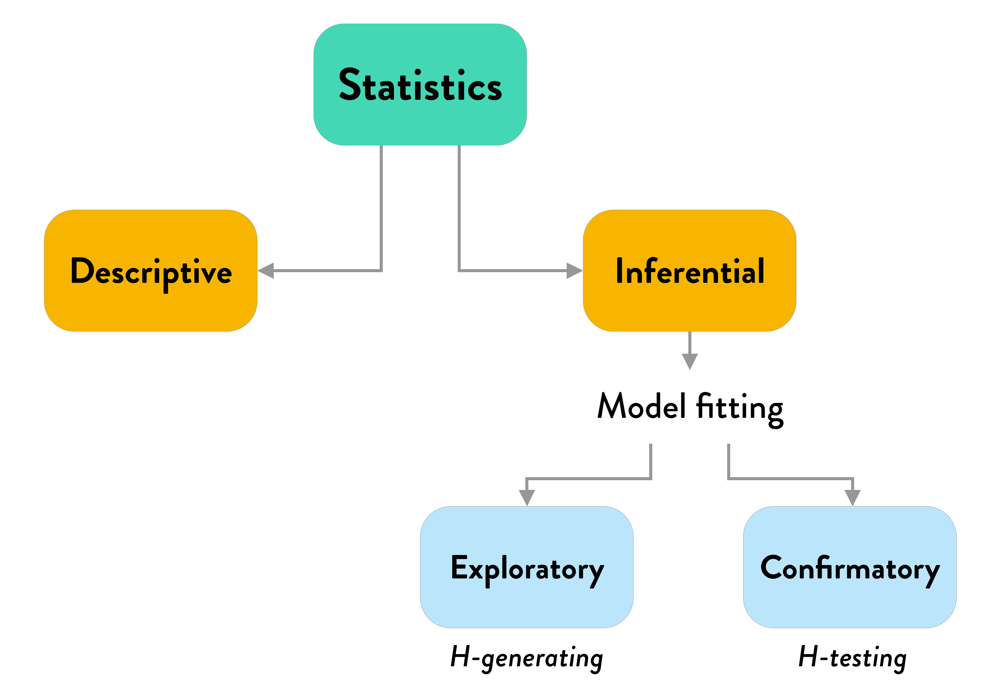

```{r setup, include=FALSE}
knitr::opts_chunk$set(echo = FALSE)
library(tidyverse)
theme_set(theme_minimal())
library(patchwork)
library(brms)
options(mc.cores = parallel::detectCores())
library(bayesplot)
library(extraDistr)
library(coretta2018itaegg)
data("ita_egg")
ita_egg <- drop_na(ita_egg, vot)
```

```{r read-bernoulli-data, message=FALSE, warning=FALSE}
pilot <- list.files(
  path = "./data/perceptual/",
  pattern = "*.csv",
  full.names = TRUE
) %>%
  map_df(~read_csv(., col_types = cols(.default = "c"))) %>%
  mutate(
    key_resp_2.keys = ifelse(key_resp_2.keys == "z", "d", "t"),
    key_resp_8.keys = ifelse(key_resp_8.keys == "z", "t", "d"),
    response = coalesce(key_resp_2.keys, key_resp_8.keys),
    response = factor(response, levels = c("t", "d")),
    burst = as.numeric(burst),
    voicing = as.numeric(voicing),
    response_n = as.numeric(response) - 1,
    vowel = factor(vowel, levels = c("a", "i", "u"))
  ) %>%
  filter(!is.na(response))

contrasts(pilot$vowel) <- "contr.sum"

burst <- filter(pilot, condition == "burst")
voicing <- filter(pilot, condition == "voicing")
```

## Road map

1. Statistical inference.
2. Frequentist inference.
1. Bayesian inference:
    1. Posterior distributions.
    1. ROPE.
    1. Bayes factors.

##

\centering \Huge

STATISTICAL INFERENCE

## Statistics



## Hypothesis testing

We want to know two (interrelated) things:

* Is there **evidence** for the hypothesis H?
* What is the **strength** of the evidence?

## Hypothesis testing

* We test H against empirical data (**hypothesis testing**).
  * It is important to decide in advance the details of the analysis.
  * Even when you think you are not making decisions, the model is.
* Inference is ultimately a **long-term endeavour** (via accumulation of knowledge).

## Hypothesis testing


##

\centering \Huge

FREQUENTIST INFERENCE

## Frequentist statistics

* **Frequentist statistics** is based on the frequentist interpretation of probability.
* **Frequentist probability of an event** is the *relative frequency* of occurrence of an event within an infinite set of imagined repetitions of that event.
* Most of modern science is based on *frequentism*.
  * lme4 package.
  * **Null Hypothesis Significance Testing**.

## Null Hypothesis Significance Testing

* NHST is based on falsification.
  * Rejection of the Null Hypothesis ($H_0$).
  * No direct "support/evidence" for hypotheses.
* *P*-value (between 0 and 1).
  * Probability of obtaining an estimate as extreme or more extreme, *assuming $H_0$ is true*.
  * Should be as low as possible.

## Null Hypothesis Significance Testing

* Significance is dichotomous.
  * $p < \alpha$ = "significant".
  * $p \geq \alpha$ = "non-significant".
* No degrees of significance.
* "Significance" is a concept that makes sense only within frequentist statistics (NHST).

## (Frequentist) confidence intervals

<https://rpsychologist.com/d3/ci/>

##

\centering \Huge

BAYESIAN INFERENCE

## Bayesian inference

Bayesian statistics is based on the Bayesian interpretation of the **Bayes theorem**.

$$ P(\theta \mid d) = \frac{P(d \mid \theta) \times P(\theta)}{P(d)} $$

## Bayesian inference

* Evidence for any H (even the null).
* Strength of evidence.
* Capitalise on previous knowledge.

## Bayesian inference

Three ways of doing hypothesis testing with Bayesian statistics:

* Inference from the **posterior**.
* Inference using a **Region Of Practical Equivalence** (ROPE).
* Inference using the **Bayes factor**.

## Inference from the posterior

1. Formulate a **hypothesis**:
    * H: Condition B decreases reaction times relative to Condition A.
2. Choose **model specification** (including priors).
3. Collect data.
4. Calculate the **posterior** (fit the model):
    * Condition B 95% CI = [-80, -15] ms.
5. **Inference**:
    * The posterior suggests that Condition B decreases reaction times by 15 to 80 ms at 95% confidence.
    * The posterior is **compatible with H**.

## Inference from the posterior

1. Formulate a **hypothesis**:
    * H: Condition B decreases reaction times relative to Condition A *by 100 ms*.
2. Choose **model specification** (including priors).
3. Collect data.
4. Calculate the **posterior** (fit the model):
    * Condition B 95% CI = [-80, -15] ms.
5. **Inference**:
    * The posterior suggests that Condition B decreases reaction times by 15 to 80 ms at 95% confidence.
    * The posterior is **not compatible with H**.

## Inference with a ROPE

H0 vs H1

* H1 states that Condition B increases reaction times (alternative hypothesis), while H0 states that Condition B does not increase reaction times (null hypothesis, null effect).
  * $H_1: \beta > 0$
  * $H_0: \beta = 0$

## Inference with a ROPE

Region Of Practical Equivalence (ROPE):

* Define a region around $\beta = 0$ that practically corresponds to a null effect.
  * For example: [-5, +5] ms ($-5 \geq \beta \leq +5$ = null effect).
  * This ROPE has a width of 10 ms.
* Choose a minimal sample size (ideally based on a prospective power analysis).
* Collect data until the 95% CI of $\beta$ has a width equal to or smaller than the width of the ROPE.

## Inference with a ROPE


## Inference with a ROPE

* We focus on the estimate **precision** of $\beta$.
* Independent from the value of $\beta$.
* Higher precision means greater confidence in the estimated value of $\beta$.

## Bayes Factor

The Bayes factor is the ratio of the likelihood of H1 to the likelihood of H2.

$BF_{12} = \mathcal{L}(H_1) / \mathcal{L}(H_2)$

## Bayes Factor

| BF      | p(M1\|D)    | evidence    |
|---------|------------|-------------|
| 1--3    | 0.5--0.75  | weak        |
| 3--20   | 0.75--0.95 | positive    |
| 20--150 | 0.95--0.99 | strong      |
| > 150   | > 0.99     | very strong |

## Bayes Factor

\tiny

```{r vot3-bf-priors, echo=TRUE}
priors <- c(
  prior(normal(40, 10), class = Intercept),
  prior(cauchy(0, 10), class = sigma),
  prior(normal(10, 10), class = b, coef = "c1_placecoronal"),
  prior(normal(20, 10), class = b, coef = "c1_placevelar"),
  prior(normal(0, 25), class = sd),
  prior(lkj(2), class = cor)
)
```

<!-- ## Bayes Factor -->

<!-- ```{r vot3-bf, echo=TRUE} -->
<!-- vot3_bf <- brm( -->
<!--   vot ~ 1 + c1_place + (1 + c1_place | speaker), -->
<!--   family = gaussian(), -->
<!--   prior = priors, -->
<!--   data = ita_egg, -->
<!--   chains = 4, -->
<!--   iter = 20000, -->
<!--   file = "./cache/vot3_bf", -->
<!--   save_all_pars = TRUE -->
<!-- ) -->
<!-- ``` -->

<!-- ## Bayes Factor -->

<!-- ```{r vot3-bf-null-priors, echo=TRUE} -->
<!-- priors_null <- c( -->
<!--   prior(normal(40, 10), class = Intercept), -->
<!--   prior(cauchy(0, 10), class = sigma), -->
<!--   prior(normal(0, 25), class = sd) -->
<!-- ) -->
<!-- ``` -->

<!-- ## Bayes Factor -->

<!-- ```{r vot3-bf-null, echo=TRUE} -->
<!-- vot3_bf_null <- brm( -->
<!--   vot ~ 1 + c1_place + (1 | speaker), -->
<!--   family = gaussian(), -->
<!--   prior = priors_null, -->
<!--   data = ita_egg, -->
<!--   chains = 4, -->
<!--   iter = 20000, -->
<!--   file = "./cache/vot3_bf_null", -->
<!--   save_all_pars = TRUE -->
<!-- ) -->
<!-- ``` -->

<!-- ## Bayes Factor -->

<!-- ```{r bf, echo=TRUE, cache=TRUE, dependson=c("vot3-bf-priors", "vot3-bf", "vot3-bf-null-priors", "vot3-bf-null")} -->
<!-- bf <- bayes_factor(vot3_bf, vot3_bf_null) -->
<!-- ``` -->

<!-- ## Bayes Factor -->

<!-- \tiny -->

<!-- ```{r bf-2, echo=TRUE} -->
<!-- bf -->
<!-- ``` -->

<!-- ## Sensitivity analysis -->
