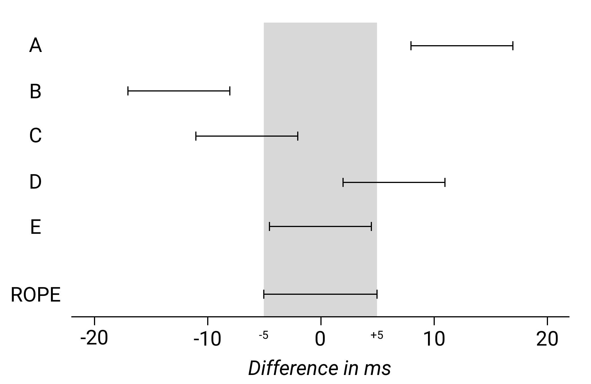

```{r setup, include=FALSE}
knitr::opts_chunk$set(echo = FALSE)
library(tidyverse)
theme_set(theme_minimal())
library(patchwork)
library(brms)
options(mc.cores = parallel::detectCores())
library(bayesplot)
library(extraDistr)
library(coretta2018itaegg)
data("ita_egg")
ita_egg <- drop_na(ita_egg, vot)
```

```{r read-bernoulli-data, message=FALSE, warning=FALSE}
pilot <- list.files(
  path = "./data/perceptual/",
  pattern = "*.csv",
  full.names = TRUE
) %>%
  map_df(~read_csv(., col_types = cols(.default = "c"))) %>%
  mutate(
    key_resp_2.keys = ifelse(key_resp_2.keys == "z", "d", "t"),
    key_resp_8.keys = ifelse(key_resp_8.keys == "z", "t", "d"),
    response = coalesce(key_resp_2.keys, key_resp_8.keys),
    response = factor(response, levels = c("t", "d")),
    burst = as.numeric(burst),
    voicing = as.numeric(voicing),
    response_n = as.numeric(response) - 1,
    vowel = factor(vowel, levels = c("a", "i", "u"))
  ) %>%
  filter(!is.na(response))

contrasts(pilot$vowel) <- "contr.sum"

burst <- filter(pilot, condition == "burst")
voicing <- filter(pilot, condition == "voicing")
```

## Road map

1. Inference.
1. Bayesian inference:
    1. Posterior distributions.
    1. ROPE.
    1. Bayes factors.

## 

\centering \Huge

INFERENCE

## Inference


\tiny Open Learning Initiative, https://oli.cmu.edu/courses/concepts-of-statistics/ (CC BY-NC-SA 4.0)

## Inference


## Inference

We want to know two things:

* Is there **evidence** for the hypothesis H?
* What is the **strength** of the evidence?

## Inference

**Inferential statistics**.

* We test H against empirical data (hypothesis testing).
  * It is important to decide in advance the details of the analysis (model and prior specification among other things).
* Inference is ultimately a long-term endaveour (via accumulation of knowledge).

## Inference

Three ways of doing inference (hypothesis testing) with Bayesian statistics:

* Inference from the **posterior**.
* Inference using a **Region Of Practical Equivalence** (ROPE).
* Inference using the **Bayes factor**.

## Inference from the posterior

1. Formulate **hypothesis**:
    * H: Condition B decreases reaction times relative to Condition A.
2. Choose **priors**:
    * $\beta = HalfNormal(0, -500)$ (plus other relevant priors).
3. Collect data.
4. Calculate **posterior**:
    * Condition B 95% CI = [-80, -15] ms.
5. **Inference**:
    * The posterior suggests that Condition B decreases reaction times by 15 to 80 ms at 95% confidence.

## Inference from the posterior

1. Formulate **hypothesis**:
    * H: Condition B decreases reaction times relative to Condition A *by 100 ms*.
2. Choose **priors**:
    * $\beta = HalfNormal(47.5, 16.25)$ (plus other relevant priors).
3. Collect data.
4. Calculate **posterior**:
    * Condition B 95% CI = [-80, -15] ms.
5. **Inference**:
    * The posterior suggests that Condition B decreases reaction times by a smaller amount than expected from H (15 to 80 ms at 95% confidence).

## Inference with a ROPE

H0 vs H1

* H1 states that Condition B increases segment duration (alternative hypothesis), while H0 states that Condition B does not increase segment duration (null hypthesis, null effect).
  * $H_1: \beta > 0$
  * $H_0: \beta = 0$

## Inference with a ROPE

Region of Practical Equivalence (ROPE):

* Define a region around $\beta = 0$ that practically correponds to a null effect.
  * For example: [-5, +5] ms ($-5 \geq \beta \leq +5$ = null effect).
  * This ROPE has a width of 10 ms.
* Choose a minimal sample size (ideally based on prospective power analyses).
* Collect data until the 95% CI of $\beta$ has width equal to or smaller than the width of the ROPE.
  * We focus on the estimate **precision** of $\beta$.
  * Independent from the value of $\beta$.
  * Higher precision means greater confidence in the estimated value of $\beta$.

## Inference with a ROPE



## Bayes Factor

The Bayes factor is the ratio of the likelihood of H1 to the likelihood of H2.

$BF_{12} = \mathcal{L}(H_1) / \mathcal{L}(H_2)$

## Bayes Factor

| BF      | p(M1\|D)    | evidence    |
|---------|------------|-------------|
| 1--3    | 0.5--0.75  | weak        |
| 3--20   | 0.75--0.95 | positive    |
| 20--150 | 0.95--0.99 | strong      |
| > 150   | > 0.99     | very strong |

## Bayes Factor

\tiny

```{r vot3-bf-priors, echo=TRUE}
priors <- c(
  prior(normal(40, 10), class = Intercept),
  prior(cauchy(0, 10), class = sigma),
  prior(normal(10, 10), class = b, coef = "c1_placecoronal"),
  prior(normal(20, 10), class = b, coef = "c1_placevelar"),
  prior(normal(0, 25), class = sd),
  prior(lkj(2), class = cor)
)
```

## Bayes Factor

```{r vot3-bf, echo=TRUE}
vot3_bf <- brm(
  vot ~ 1 + c1_place + (1 + c1_place | speaker),
  family = gaussian(),
  prior = priors,
  data = ita_egg,
  chains = 4,
  iter = 20000,
  file = "./cache/vot3_bf",
  save_all_pars = TRUE
)
```

## Bayes Factor

```{r vot3-bf-null-priors, echo=TRUE}
priors_null <- c(
  prior(normal(40, 10), class = Intercept),
  prior(cauchy(0, 10), class = sigma),
  prior(normal(0, 25), class = sd)
)
```

## Bayes Factor

```{r vot3-bf-null, echo=TRUE}
vot3_bf_null <- brm(
  vot ~ 1 + c1_place + (1 | speaker),
  family = gaussian(),
  prior = priors_null,
  data = ita_egg,
  chains = 4,
  iter = 20000,
  file = "./cache/vot3_bf_null",
  save_all_pars = TRUE
)
```

## Bayes Factor

```{r bf, echo=TRUE, cache=TRUE, dependson=c("vot3-bf-priors", "vot3-bf", "vot3-bf-null-priors", "vot3-bf-null")}
bf <- bayes_factor(vot3_bf, vot3_bf_null)
```

## Bayes Factor

\tiny

```{r bf-2, echo=TRUE}
bf
```

## Sensitivity analysis
