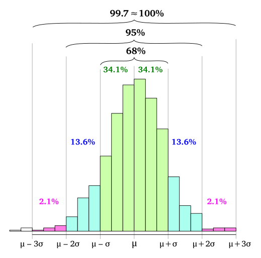
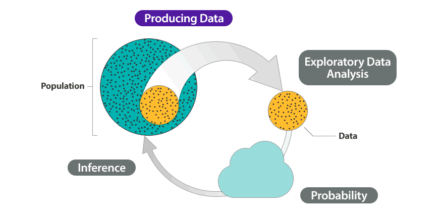
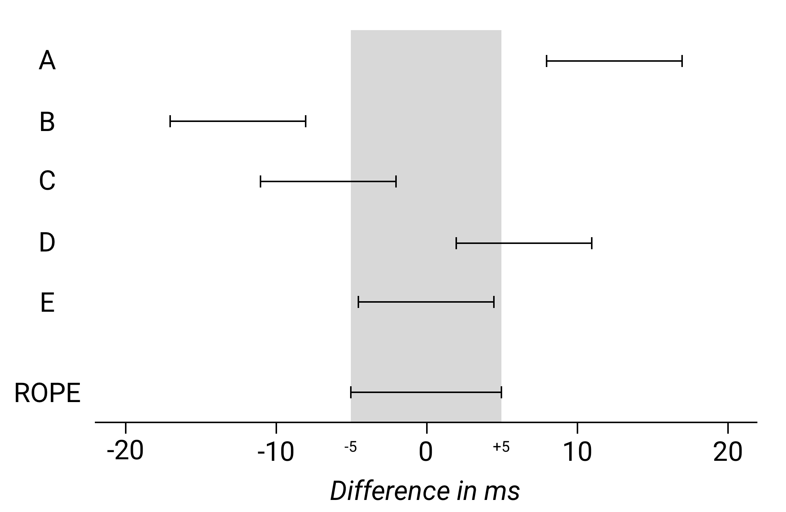

```{r setup, include=FALSE}
knitr::opts_chunk$set(echo = FALSE)
library(tidyverse)
theme_set(theme_minimal())
library(patchwork)
library(brms)
options(mc.cores = parallel::detectCores())
library(bayesplot)
library(extraDistr)
library(coretta2018itaegg)
data("ita_egg")
ita_egg <- drop_na(ita_egg, vot)
```

```{r read-bernoulli-data, message=FALSE, warning=FALSE}
pilot <- list.files(
  path = "./data/perceptual/",
  pattern = "*.csv",
  full.names = TRUE
) %>%
  map_df(~read_csv(., col_types = cols(.default = "c"))) %>%
  mutate(
    key_resp_2.keys = ifelse(key_resp_2.keys == "z", "d", "t"),
    key_resp_8.keys = ifelse(key_resp_8.keys == "z", "t", "d"),
    response = coalesce(key_resp_2.keys, key_resp_8.keys),
    response = factor(response, levels = c("t", "d")),
    burst = as.numeric(burst),
    voicing = as.numeric(voicing),
    response_n = as.numeric(response) - 1,
    vowel = factor(vowel, levels = c("a", "i", "u"))
  ) %>%
  filter(!is.na(response))

contrasts(pilot$vowel) <- "contr.sum"

burst <- filter(pilot, condition == "burst")
voicing <- filter(pilot, condition == "voicing")
```

## Installation

Safe method:

* **Install Rstan first**: https://github.com/stan-dev/rstan/wiki/RStan-Getting-Started (see *Installation of Rstan*, *Checking the C++ Toolchain*, and *Configuration of the C++ Toolchain*).
  * Note that details in *Checking the C++ Toolchain* differ depending on your OS.
* **Install brms**: https://github.com/paul-buerkner/brms#how-do-i-install-brms.

## Road map

* Basic concepts
* Model fitting with brms
* Bayesian inference
* BYOD clinic

## Learning outcomes

* Understand the basic concepts behind Bayesian statistics and how this differs from frequentist statistics.
* Be able to set up and fit a Bayesian linear regression model using brms.
* Understand Bayesian inference methods.

## 

\centering \Huge

BASIC CONCEPTS

## Random variables

* We have a question about the world, so we collect data (sample from a population).
  * y = ($y_1$, $y_2$, $y_3$, $y_4$, ..., $y_n$)
* We want to know how the data (the sample $y$) was generated.
* In probability theory, data is generated by a random variable $Y$.

## Random variables

* $Y$ is a variable whose value is generated by a random event.
* $Y$ is uncertain.
  * We can describe $Y$ as a probability distribution.

## Random variables

* Probability distribution.
  * A list of the values a random variable could take on along with their corresponding probability.
* Probability distributions can be expressed by a set of parameters $\Theta = (\theta_1, ..., \theta_n)$.
* Some probability distributions:
  * $Normal(\mu, \sigma)$,
  * $Binomial(n, p)$,
  * $Poisson(\lambda)$

## Frequentist vs Bayesian view

* Parameters: $\mu$, $\sigma$, $p$, $\lambda$, ...
* Frequentist view:
  * The parameters are **fixed** (they are unknown but certain).
  * They take on a specific value.
* Bayesian view:
  * The parameters are **random variables** (they are unkown and uncertain).
  * We describe each parameter as a probability distribution, expressed by a set of **hyperparameters**.

## Continuous random variables

\centering \Huge

$vot_i \sim Normal(\mu, \sigma)$

## Continous random variable

* We want to estimate the parameters $\mu$ and $\sigma$ from the data.
  * We describe the parameters using probability distributions (defined by hyperparameters).

## Continous random variable

\centering \Huge

$vot_i \sim Normal(\mu, \sigma)$

$\mu \sim Normal(\mu_1, \sigma_1)$

$\sigma \sim HalfCauchy(x_0, \gamma)$

<!-- ## Bayes' Theorem

\Huge

$$ P(\theta \mid d) = \frac{P(d \mid \theta) \, P(\theta)}{P(d)} $$

## Bayes' Theorem

$$ posterior\ probability = \frac{likelihood \times prior}{marginal\ likelihood} $$ -->

## Priors 

* We can incorporate previous knowledge (belief) about the parameters using **priors** (*prior probability distributions*).
  * We specify the hyperparameters $\mu_1$, $\sigma_1$, $x_0$, $\gamma$ of the prior probability distributions.
* Priors are chosen based on expert knowledge, previous studies, pilot data...
  * Priors must **not** be chosen based on the data to be analysed.

## Bayesian belief update

\Huge

$$ prior\ probability\times evidence\ (data) = posterior\ probability $$

## Bayesian belief update

https://nanx.shinyapps.io/conjugate-normal-umkv/

<!-- ## Priors

* Informative and weakly informative priors.
* Uninformative or diffuse priors.
  * Uniform distribution.
* Regularising priors.

## Normal prior



\footnotesize

Melikamp, https://commons.wikimedia.org/wiki/File:Empirical_rule_histogram.svg (CC BY-SA 4.0) -->

##

\centering \Huge

MODEL FITTING

## Italian VOT

* Voice Onset Time (VOT): Time difference (ms) between the release of a stop and the onset of voicing (vocal fold vibration).
* Toy study of Italian VOT in stops.

$$ vot_i \sim Normal(\mu, \sigma) $$

## Italian VOT

* Previous literature on VOT in Italian \citep{esposito2002, stevens2010a} report VOT values for voiceless stops in the range of 20--60 ms.
* We can include our knowledge with a prior for $\mu$.
  * $Normal(40, 10)$.
  * This is a somewhat strongly informative prior.

## Italian VOT

```{r mean-prior, eval=FALSE, echo=TRUE}
ggplot() +
  aes(x = c(-30, 110)) +
  stat_function(fun = dnorm, n = 101, args = list(40, 10)) +
  labs(title = "Normal (Gaussian) distribution", subtitle = "mean = 40, SD = 10")
```

## Italian VOT

```{r mean-prior-p}
ggplot() +
  aes(x = c(-30, 110)) +
  stat_function(fun = dnorm, n = 101, args = list(40, 10)) +
  labs(title = "Normal (Gaussian) distribution", subtitle = "mean = 40, SD = 10")
```

## Normal prior

{width=250px}

\tiny Melikamp, https://commons.wikimedia.org/wiki/File:Empirical_rule_histogram.svg (CC BY-SA 4.0)

## Italian VOT

\tiny

```{r mean-prior-2, eval=FALSE, echo=TRUE}
ggplot() +
  aes(x = c(-30, 110)) +
  stat_function(fun = dnorm, n = 101, args = list(40, 20)) +
  labs(title = "Normal (Gaussian) distribution", subtitle = "mean = 40, SD = 20")
```

## Italian VOT

```{r mean-prior-2-p}
ggplot() +
  aes(x = c(-30, 110)) +
  stat_function(fun = dnorm, n = 101, args = list(40, 20)) +
  labs(title = "Normal (Gaussian) distribution", subtitle = "mean = 40, SD = 20")
```

## Italian VOT

\centering \Large

$vot_i \sim Normal(\mu, \sigma)$

$\mu \sim Normal(40, 10)$

What about $\sigma$?

## Italian VOT

\centering \Large

$vot_i \sim Normal(\mu, \sigma)$

$\mu \sim Normal(40, 10)$

$\sigma \sim HalfCauchy(x_0, \gamma)$

## Cauchy prior

\tiny

```{r cauchy-prior, eval=FALSE, echo=TRUE}
ggplot() +
  aes(x = c(-100, 100)) +
  stat_function(fun = dcauchy, n = 201, args = list(0, 5), colour = "#1b9e77", size = 1) +
  stat_function(fun = dcauchy, n = 201, args = list(0, 10), colour = "#d95f02", size = 1) +
  stat_function(fun = dcauchy, n = 201, args = list(0, 15), colour = "#7570b3", size = 1) +
  labs(title = "Cauchy distribution")
```

## Cauchy prior

```{r cauchy-prior-p}
ggplot() +
  aes(x = c(-100, 100)) +
  stat_function(fun = dcauchy, n = 201, args = list(0, 5), colour = "#1b9e77", size = 1) +
  stat_function(fun = dcauchy, n = 201, args = list(0, 10), colour = "#d95f02", size = 1) +
  stat_function(fun = dcauchy, n = 201, args = list(0, 15), colour = "#7570b3", size = 1) +
  labs(title = "Cauchy distribution")
```

## Half Cauchy prior

\tiny

```{r cauchy-prior-2, eval=FALSE, echo=TRUE}
ggplot() +
  aes(x = c(0, 100)) +
  stat_function(fun = dhcauchy, n = 201, args = list(5), colour = "#1b9e77", size = 1) +
  stat_function(fun = dhcauchy, n = 201, args = list(10), colour = "#d95f02", size = 1) +
  stat_function(fun = dhcauchy, n = 201, args = list(15), colour = "#7570b3", size = 1) +
  labs(title = "Half Cauchy distribution")
```

## Half Cauchy prior

```{r cauchy-prior-2-p}
ggplot() +
  aes(x = c(0, 100)) +
  stat_function(fun = dhcauchy, n = 201, args = list(5), colour = "#1b9e77", size = 1) +
  stat_function(fun = dhcauchy, n = 201, args = list(10), colour = "#d95f02", size = 1) +
  stat_function(fun = dhcauchy, n = 201, args = list(15), colour = "#7570b3", size = 1) +
  labs(title = "Half Cauchy distribution")
```

## Half cauchy prior

```{r cauchy-2-hdi, echo=TRUE}
library(HDInterval)
inverseCDF(c(0.025, 0.975), phcauchy, 5)
inverseCDF(c(0.025, 0.975), phcauchy, 10)
inverseCDF(c(0.025, 0.975), phcauchy, 15)
```

## Italian VOT

\centering \Large

$vot_i \sim Normal(\mu, \sigma)$

$\mu \sim Normal(40, 10)$

$\sigma \sim HalfCauchy(0, 10)$

## Italian VOT

* We have a model which incorporates (some of) our knowledge about VOT (through the priors for $\mu$ and $\sigma$).
* Now we want to obtain the **posterior distributions** of $\mu$ and $\sigma$.
  * The posterior distribution is the prior distribution *conditioned* on the data.
* **brms** R package: Bayesian Regression Models using Stan \citep{burkner2018}.

## brms

* Stan \citep{stan-development-team2017}.
  * Statistical programming language written in C++.
  * Fit Bayesian models (calculate posterior distributions).
* Calculation can be complex and/or impossible, so we take many samples from the data and from the possible parameter values to find the posterior distributions of the hyperparameters.
  * Markov Chain Monte Carlo (MCMC) sampling using the No-U-Turn sampler (NUTS).

## brms

* brms translates R code into Stan code.
* Stan code is run in Stan via Rstan, an R interface to Stan.
* `brm()` function from brms.
  * lme4 syntax (`y ~ x + (1|w)`).
  * Creates a Stan model, which is compiled (in C++) and run.

## brms

```{r brm, eval=FALSE, echo=TRUE}
library(brms)

vot1 <- brm(
  <model_formula>,
  <family>,
  <prior>,
  <data>,
  chains = 4,
  iter = 2000
)
```

## brms

```{r brm-2, eval=FALSE, echo=TRUE}
library(brms)

vot1 <- brm(
  vot ~ 1,
  family = gaussian(),
  <prior>,
  data = ita_egg,
  chains = 4,
  iter = 2000
)
```

## Get prior

\tiny

```{r get-prior, echo=TRUE}
get_prior(
  vot ~ 1,
  family = gaussian(),
  data = ita_egg
)
```

## Prior predictive checks

```{r vot1-priors, echo=TRUE}
nsim <- 1000
nobs <- 1000

y <- matrix(rep(NA, nsim * nobs), ncol = nobs)

mu <- rnorm(nsim, 40, 10)
sigma <- rhcauchy(nsim, 10)

for (i in 1:nsim) {
  y[i,] <- rnorm(nobs, mean = mu[i], sd = sigma[i])
}
```

## Prior predictive checks

```{r vot1-priors-plot, eval=FALSE, echo=TRUE}
rand_sample <- sample(1:nsim, 9, replace = FALSE)
plots <- list()

j = 1

for (i in rand_sample) {
  my_data <- enframe(y[i,], name = NULL)
  plots[[j]] <- ggplot(data = my_data) +
    aes(x = value) +
    geom_density() +
    labs(x = element_blank(), y = element_blank())
  j = j + 1
}

wrap_plots(plots, nrow = 3)
```

## Prior predictive checks

```{r vot1-priors-plot-p}
rand_sample <- sample(1:nsim, 9, replace = FALSE)
plots <- list()

j = 1

for (i in rand_sample) {
  my_data <- enframe(y[i,], name = NULL)
  plots[[j]] <- ggplot(data = my_data) +
    aes(x = value) +
    geom_density() +
    labs(x = element_blank(), y = element_blank())
  j = j + 1
}

wrap_plots(plots, nrow = 3)
```

## Set prior

```{r set-prior, echo=TRUE}
priors <- c(
  prior(normal(40, 10), class = Intercept),
  prior(cauchy(0, 10), class = sigma)
)
```

## Run the model

```{r vot1, echo=TRUE}
vot1 <- brm(
  vot ~ 1,
  family = gaussian(),
  prior = priors,
  data = ita_egg,
  chains = 4,
  iter = 2000,
  file = "./cache/vot1"
)
```

## Model summary

\tiny

```{r vot1-sum, echo=TRUE}
vot1
```

## Plot model

```{r vot1-plot, echo=TRUE, fig.width=7, fig.height=4}
plot(vot1)
```

## Posterior predictive check

```{r vot1-pp, echo=TRUE, fig.width=7, fig.height=4}
pp_check(vot1, nsamples = 100)
```

## Adding predictors

$vot_i \sim Normal(\mu_i, \sigma)$

$\mu_i = \alpha + \beta_1 \times coronal_i + \beta_2 \times velar_i$

$\alpha \sim Normal(\mu_1, \sigma_1)$

$\beta_1 \sim Normal(\mu_2, \sigma_2)$

$\beta_2 \sim Normal(\mu_3, \sigma_3)$

$\sigma \sim HalfCauchy(x_0, \gamma)$

## Adding predictors

$vot_i \sim Normal(\mu_i, \sigma)$

$\mu_i = \alpha + \beta_1 \times coronal_i + \beta_2 \times velar_i$

$\alpha \sim Normal(25, 10)$

$\beta_1 \sim Normal(10, 10)$

$\beta_2 \sim Normal(20, 10)$

$\sigma \sim HalfCauchy(0, 10)$

## Adding predictors

\tiny

```{r get-prior-2, echo=TRUE}
get_prior(
  vot ~ 1 + c1_place,
  family = gaussian(),
  data = ita_egg
)
```

## Adding predictors

\tiny

```{r set-prior-2, echo=TRUE}
priors <- c(
  prior(normal(25, 10), class = Intercept),
  prior(cauchy(0, 10), class = sigma),
  prior(normal(10, 10), class = b, coef = "c1_placecoronal"),
  prior(normal(20, 10), class = b, coef = "c1_placevelar")
)
```

## Adding predictors

```{r vot2, echo=TRUE}
vot2 <- brm(
  vot ~ 1 + c1_place,
  family = gaussian(),
  prior = priors,
  data = ita_egg,
  chains = 4,
  iter = 2000,
  file = "./cache/vot2"
)
```

## Adding predictors

\tiny

```{r vot-sum}
vot2
```

## Adding predictors

```{r vot2-areas, echo=TRUE, warning=FALSE, fig.width=7, fig.height=4}
mcmc_areas(vot2, regex_pars = "b_", prob = 0.95)
```

## Adding predictors

```{r vot2-cond, echp=TRUE}
conditional_effects(vot2)
```

## Random effects

\centering \scriptsize

$vot_i \sim Normal(\mu_i, \sigma)$

$\mu_i = \alpha + \alpha_{speaker[i]} + (\beta_1 + \beta_{1speaker[i]}) \times coronal_i + (\beta_2 + \beta_{2speaker[i]}) \times velar_i$

$$\begin{bmatrix}
\alpha_{speaker}\\
\beta_{1speaker[i]}\\
\beta_{2speaker[i]}
\end{bmatrix} \sim MVNormal(\begin{bmatrix}0\\0\\0\end{bmatrix}, S)$$

## Random effects

\centering \scriptsize

$\alpha \sim Normal(25, 10)$

$\alpha_{speaker} \sim Normal(0, \sigma_{speaker})$

$\beta_1 \sim Normal(10, 10)$

$\beta_2 \sim Normal(20, 10)$

$\sigma_{\alpha{speaker}} \sim Normal(0, \sigma_{speaker})$

$\sigma_{\beta{1speaker}} \sim HalfCauchy(0, 10)$

$\sigma_{\beta{2speaker}} \sim HalfCauchy(0, 10)$

$\sigma_{speaker} \sim HalfCauchy(0, 10)$

$\sigma \sim HalfCauchy(0, 10)$

## Random effects

\tiny

```{r get-prior-3, echo=TRUE}
get_prior(
  vot ~ 1 + c1_place + (1 + c1_place | speaker),
  family = gaussian(),
  data = ita_egg
)
```

## Random effects

\tiny

```{r set-prior-3, echo=TRUE}
priors <- c(
  prior(normal(40, 10), class = Intercept),
  prior(cauchy(0, 10), class = sigma),
  prior(normal(10, 10), class = b, coef = "c1_placecoronal"),
  prior(normal(20, 10), class = b, coef = "c1_placevelar"),
  prior(normal(0, 25), class = sd),
  prior(lkj(2), class = cor)
)
```

## Random effects

```{r vot3, echo=TRUE}
vot3 <- brm(
  vot ~ 1 + c1_place + (1 + c1_place | speaker),
  family = gaussian(),
  prior = priors,
  data = ita_egg,
  chains = 4,
  iter = 2000,
  file = "./cache/vot3"
)
```

## Random effects

```{r vot3-plot}
a <- plot(vot3, ask = FALSE, plot = FALSE)
a[[1]]
```

## Random effects

```{r vot3-plot-2}
a[[2]]
```

## Random effects

\tiny

```{r vot3-sum}
cat(capture.output(summary(vot3))[1:16], sep = "\n")
```

## Random effects

\tiny

```{r vot3-sum-2}
cat(capture.output(summary(vot3))[18:30], sep = "\n")
```

## Random effects

```{r vot3-areas, echo=TRUE, warning=FALSE, fig.width=7, fig.height=4}
mcmc_areas(vot3, regex_pars = "b_", prob = 0.95)
```

## Random effects

```{r vot3-cond, echp=TRUE}
conditional_effects(vot3)
```

<!-- ## Binomial logistic regression

```{r set-prior-burst, echo=TRUE}
priors <- c(
  prior(student_t(3, 0, 2), class = Intercept),
  prior(student_t(3, 0, 2), class = b),
  prior(cauchy(0, 1), class = sd),
  prior(lkj(2), class = cor)
)
```

## Binomial logistic regression

```{r burst, echo=TRUE}
burst1 <- brm(
  response_n ~
    burst *
    vowel +
    (1+burst|participant),
  data = burst,
  prior = priors,
  family = bernoulli,
  file = "./cache/burst1",
  control = list(adapt_delta = 0.999)
)
```

## Binomial logistic regression

```{r plot-cond-burst, echo=TRUE}
conditional_effects(burst1, effects = "burst:vowel")
```
-->

## 

\centering \Huge

BAYESIAN INFERENCE

## Inference



\tiny Open Learning Initiative, https://oli.cmu.edu/courses/concepts-of-statistics/ (CC BY-NC-SA 4.0)

## Inference


## Inference

* We want to know two things:
  * If there is **evidence for our hypothesis H** (or for the value of the parameter $\theta$), and
  * What the **strength** of the evidence is.

## Inference

**Inferential statistics**.

* We test H against empirical data (hypothesis testing).
  * It is important to decide in advance the details of the analysis (model and prior specification among other things).
* Inference is ultimately a long-term endaveour (via accumulation of knowledge).

## Inference

Three ways of doing inference (hypothesis testing) with Bayesian statistics:

* Inference from the **posterior**.
* Inference using a **Region Of Practical Equivalence** (ROPE).
* Inference using the **Bayes factor**.

## Inference from the posterior

1. Formulate **hypothesis**:
    * H: Condition B decreases reaction times relative to Condition A.
2. Choose **priors**:
    * $\beta = HalfNormal(0, -500)$ (plus other relevant priors).
3. Collect data.
4. Calculate **posterior**:
    * Condition B 95% CI = [-80, -15] ms.
5. **Inference**:
    * The posterior suggests that Condition B decreases reaction times by 15 to 80 ms at 95% confidence.

## Inference from the posterior

1. Formulate **hypothesis**:
    * H: Condition B decreases reaction times relative to Condition A *by 100 ms*.
2. Choose **priors**:
    * $\beta = HalfNormal(47.5, 16.25)$ (plus other relevant priors).
3. Collect data.
4. Calculate **posterior**:
    * Condition B 95% CI = [-80, -15] ms.
5. **Inference**:
    * The posterior suggests that Condition B decreases reaction times by a smaller amount than expected from H (15 to 80 ms at 95% confidence).

## Inference with a ROPE

H0 vs H1

* H1 states that Condition B increases segment duration (alternative hypothesis), while H0 states that Condition B does not increase segment duration (null hypthesis, null effect).
  * $H_1: \beta > 0$
  * $H_0: \beta = 0$

## Inference with a ROPE

Region of Practical Equivalence (ROPE):

* Define a region around $\beta = 0$ that practically correponds to a null effect.
  * For example: [-5, +5] ms ($-5 \geq \beta \leq +5$ = null effect).
  * This ROPE has a width of 10 ms.
* Choose a minimal sample size (ideally based on prospective power analyses).
* Collect data until the 95% CI of $\beta$ has width equal to or smaller than the width of the ROPE.
  * We focus on the estimate **precision** of $\beta$.
  * Independent from the value of $\beta$.
  * Higher precision means greater confidence in the estimated value of $\beta$.

## Inference with a ROPE



## Bayes Factor

The Bayes factor is the ratio of the likelihood of H1 to the likelihood of H2.

$BF_{12} = \mathcal{L}(H_1) / \mathcal{L}(H_2)$

## Bayes Factor

| BF      | p(M1\|D)    | evidence    |
|---------|------------|-------------|
| 1--3    | 0.5--0.75  | weak        |
| 3--20   | 0.75--0.95 | positive    |
| 20--150 | 0.95--0.99 | strong      |
| > 150   | > 0.99     | very strong |

## Bayes Factor

\tiny

```{r vot3-bf-priors, echo=TRUE}
priors <- c(
  prior(normal(40, 10), class = Intercept),
  prior(cauchy(0, 10), class = sigma),
  prior(normal(10, 10), class = b, coef = "c1_placecoronal"),
  prior(normal(20, 10), class = b, coef = "c1_placevelar"),
  prior(normal(0, 25), class = sd),
  prior(lkj(2), class = cor)
)
```

## Bayes Factor

```{r vot3-bf, echo=TRUE}
vot3_bf <- brm(
  vot ~ 1 + c1_place + (1 + c1_place | speaker),
  family = gaussian(),
  prior = priors,
  data = ita_egg,
  chains = 4,
  iter = 20000,
  file = "./cache/vot3_bf",
  save_all_pars = TRUE
)
```

## Bayes Factor

```{r vot3-bf-null-priors, echo=TRUE}
priors_null <- c(
  prior(normal(40, 10), class = Intercept),
  prior(cauchy(0, 10), class = sigma),
  prior(normal(0, 25), class = sd)
)
```

## Bayes Factor

```{r vot3-bf-null, echo=TRUE}
vot3_bf_null <- brm(
  vot ~ 1 + c1_place + (1 | speaker),
  family = gaussian(),
  prior = priors_null,
  data = ita_egg,
  chains = 4,
  iter = 20000,
  file = "./cache/vot3_bf_null",
  save_all_pars = TRUE
)
```

## Bayes Factor

```{r bf, echo=TRUE, cache=TRUE, dependson=c("vot3-bf-priors", "vot3-bf", "vot3-bf-null-priors", "vot3-bf-null")}
bf <- bayes_factor(vot3_bf, vot3_bf_null)
```

## Bayes Factor

\tiny

```{r bf-2, echo=TRUE}
bf
```

## Sensitivity analysis
